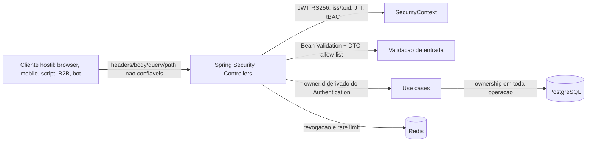

# 🚀 EGSYS Tasks API

[](https://github.com/omatheusdutra/teste-api-spring-egsys/actions/workflows/ci.yml)
[](https://github.com/omatheusdutra/teste-api-spring-egsys/actions/workflows/security.yml)
[](https://github.com/omatheusdutra/teste-api-spring-egsys/releases/tag/v1.0.0)


API RESTful de tarefas em Kotlin + Spring Boot, desenhada como backend production-ready para o teste tecnico da EGSYS:
segura por padrao, observavel, testavel e pronta para rodar em containers.

## 0. PRINCIPIO FUNDADOR - "NEVER TRUST THE CLIENT"

**NUNCA CONFIE NO CLIENTE.** Cliente aqui significa qualquer consumidor da API: navegador, app mobile, script,
Postman/Bruno/curl, outro microsservico interno, integracao B2B externa, bot, scanner ou atacante humano.

Tudo que vier em um request - headers, body, query params, path variables, cookies, IDs, flags, roles, timestamps,
ownership e totais calculados - e hostil ate prova em contrario. O servidor:

- revalida todo input com Bean Validation e regras de negocio;
- deriva o usuario autenticado a partir do JWT/Spring Security, nunca do body;
- recheca ownership a cada operacao para evitar IDOR;
- recalcula valores informados pelo cliente quando houver regra derivada;
- nunca delega decisao de autorizacao ao chamador;
- nunca acredita em campos como `isAdmin`, `userId`, `ownerId` ou `role` vindos do JSON.

Consequencia pratica nesta API: controllers nao recebem `userId` em DTO. A identidade vem do `Authentication` do Spring
Security via `SecurityContextHolder`, e os use cases recebem `ownerId` derivado do contexto autenticado.

## ✅ Estado Atual

Etapas 0 a 8 concluidas: bootstrap, dominio puro em TDD, persistencia PostgreSQL, casos de uso,
API REST v1, seguranca com JWT RS256, Argon2id, RBAC, anti-IDOR, revogacao/rate limiting e observabilidade com
logs JSON, correlation ID, Prometheus autenticado, tracing OTLP, health checks customizados e inovacoes com status,
Outbox, historico auditavel e CSV. A entrega inclui Dockerfile distroless, docker-compose, Makefile, Bruno collection e
workflows de CI/seguranca.

## 🧱 Stack Base

- Kotlin 2.x, JVM 21, Spring Boot 3.5.x
- Gradle Kotlin DSL
- PostgreSQL, Redis, Spring Data JPA, Flyway
- Spring Security, JJWT, Bouncy Castle
- JUnit 5, Kotest assertions, MockK, Testcontainers, ArchUnit
- ktlint, detekt, JaCoCo, Pitest
- Micrometer, Prometheus, OpenTelemetry e logs JSON

## 🧪 Como Testar

Pre-requisitos: JDK 21. Docker e necessario para executar os testes de persistencia com Testcontainers; sem Docker, a
tag `postgres` e excluida automaticamente do `test` local.

```bash
./gradlew check
./gradlew pitest
```

## 🛡️ Gates de Qualidade

| Gate | Status local |
| --- | --- |
| `./gradlew check` | Verde |
| `./gradlew pitest` | Verde, mutation score 70% |
| JaCoCo | Verde via `check`, minimo 85% linhas e 80% branches |
| Trivy, Semgrep e gitleaks | Configurados no workflow `.github/workflows/security.yml` |

## 🐳 Como Executar

Subir dependencias e API em containers:

```bash
docker compose up -d --build
```

Rodar a API local usando Postgres/Redis do compose:

```bash
docker compose up -d postgres redis
./gradlew bootRun
```

Comandos curtos tambem estao no `Makefile`: `make check`, `make pitest`, `make compose-up`, `make docker-build`.

Para o Prometheus raspar `/actuator/prometheus`, gere um token admin local e substitua o placeholder de
`config/prometheus/secrets/api-token.example` no formato `Bearer <token>` no seu ambiente local.

## ⚡ Tour de 30s

1. Abra a colecao Bruno `bruno/egsys-tasks-api`.
2. Execute `01 Register`, depois `02 Login`.
3. Copie `accessToken` da resposta de login para o ambiente `local`.
4. Execute `03 Create Task` e `04 List Tasks`.

## 📚 API REST v1

Swagger UI: `/swagger-ui.html`

Endpoints implementados:

- `POST /api/v1/auth/register`
- `POST /api/v1/auth/login`
- `POST /api/v1/auth/refresh`
- `POST /api/v1/auth/logout`
- `POST /api/v1/auth/revoke-all/{userId}` (`ROLE_ADMIN`)
- `GET /api/v1/categorias`
- `POST /api/v1/tarefas`
- `GET /api/v1/tarefas/{id}`
- `GET /api/v1/tarefas?cursor={cursor}&limit={1..100}`
- `GET /api/v1/tarefas/export.csv`
- `PUT /api/v1/tarefas/{id}`
- `POST /api/v1/tarefas/{id}/status/{em-andamento|concluida|cancelada}`
- `GET /api/v1/tarefas/{id}/historico`
- `DELETE /api/v1/tarefas/{id}`
- `GET /actuator/health` (autenticado)
- `GET /actuator/prometheus` (autenticado)

Erros HTTP usam `application/problem+json` via RFC 7807 `ProblemDetail`. As listagens de tarefas usam paginacao
cursor-based, evitando offset em colecoes grandes.

## 🧨 Superficie de Ataque

| Vetor | Defesa implementada | Teste |
| --- | --- | --- |
| JWT `alg=none` / HS256 | rejeicao explicita de algoritmo diferente de RS256 antes da assinatura | `AuthenticationTests` |
| Token expirado, adulterado, iss/aud errado ou JTI revogado | validacao rigorosa de claims + blacklist Redis por JTI | `AuthenticationTests` |
| Refresh token reutilizado | rotacao a cada uso e revogacao da familia | `RefreshTokenReuseTests` |
| IDOR em tarefas | `owner_id` no dominio, use cases e queries de repositorio | `TarefaJpaRepositoryIntegrationTest` |
| Acesso USER a endpoint ADMIN | RBAC com `@PreAuthorize` | `AuthorizationAndHeadersTests` |
| Brute force | rate limiting por IP/usuario com `Retry-After` | `AuthorizationAndHeadersTests` |
| Headers ausentes | CSP, HSTS, no-sniff, frame deny, no-referrer, permissions policy | `AuthorizationAndHeadersTests` |
| Correlation ID malicioso | regex allowlist, tamanho maximo e fallback para UUID servidor | `CorrelationIdFilterTest` |
| Vazamento de metricas internas | `/actuator/prometheus` exige JWT | `AuthorizationAndHeadersTests` |
| Perda de evento apos commit | Outbox transacional em `outbox_events` | `TarefaJpaRepositoryIntegrationTest` |
| Auditoria filtrada no cliente | Historico filtra por `owner_id` no repositorio/use case | `RestApiWebTest` |
| CSV injection / quebra de formato | campos CSV com aspas, virgulas e quebras sao escapados | `RestApiWebTest` |

## Modelo de Ameacas



| Ataque | Vetor | Defesa | Arquivo de teste | Status |
| --- | --- | --- | --- | --- |
| Zero-day exploit | dependencia vulneravel | Trivy, Dependabot, SCA no CI, runtime hardening | `ZeroDayDefenseTests.kt` | Estrutura criada |
| Malware | upload/dependencia/container comprometido | imagem distroless, sem shell, scan de container; upload futuro com ClamAV/Tika | `MalwareDefenseTests.kt` | Estrutura criada |
| MITM | downgrade/tampering de trafego | HSTS, JWT RS256, validacao de issuer/audience | `MitmDefenseTests.kt` | Estrutura criada |
| SQL Injection | query insegura | JPA parametrizado, sem concat SQL, Semgrep | `SqlInjectionTests.kt` | Estrutura criada |
| XSS | payload refletido | JSON correto, nosniff, CSP, escape em saidas HTML/email futuras | `XssReflectionTests.kt` | Estrutura criada |
| Phishing/enumeracao | API impersonada ou erro revelador | iss/aud rigorosos e mensagens genericas | `PhishingResistanceTests.kt` | Estrutura criada |
| Ransomware | credencial/host comprometido | menor privilegio DB, backups/runbook futuro, container hardening | `RansomwareResilienceTests.kt` | Estrutura criada |
| DDoS | inundacao de requests | rate limiting Redis, body limit, timeouts | `DdosDefenseTests.kt` | Estrutura criada |
| Forca bruta | tentativas massivas de login | Argon2id, throttle, erro generico | `BruteForceTests.kt` | Estrutura criada |
| Trojan/supply chain | dependencia/action maliciosa | gitleaks, CI scanners, imagem distroless, revisao de workflow | `SupplyChainTests.kt` | Estrutura criada |
| IDOR | acesso a recurso de outro usuario | filtro por `owner_id` em use cases/repositorios | `IdorTests.kt` | Estrutura criada |
| Mass assignment | `ownerId`, `role`, `isAdmin` no JSON | DTO allow-list + `ignoreUnknown=false` | `MassAssignmentTests.kt` | Implementado |
| JWT alg confusion | `none` ou HS256 | aceitar somente RS256 antes de validar assinatura | `JwtAlgConfusionTests.kt` | Estrutura criada |
| Replay de token | reutilizacao de JTI/refresh | blacklist Redis + refresh rotation | `JwtReplayTests.kt` | Estrutura criada |
| Timing attack | diferenca user inexistente vs senha errada | comparacao/hash controlado e mensagens genericas | `TimingAttackTests.kt` | Estrutura criada |
| Information disclosure | stack trace/header Server/secrets | ProblemDetail generico, stack trace desabilitado, logs sem token | `InfoLeakTests.kt` | Estrutura criada |
| CSRF | auth por cookie futuro | API stateless JWT em header; cookie exigiria SameSite+CSRF token | `CsrfDocumentationTests.kt` | Estrutura criada |
| XXE | XML parser inseguro | XML nao suportado nos endpoints JSON | `XxeTests.kt` | Estrutura criada |
| SSRF | URL outbound controlada pelo cliente | sem chamadas outbound hoje; futura whitelist e bloqueio de IP interno | `SsrfTests.kt` | Estrutura criada |
| Deserializacao insegura | polymorphic typing/ObjectInputStream | Jackson sem default typing e DTOs explicitos | `DeserializationTests.kt` | Estrutura criada |

Nao coberto ainda de forma executavel: ClamAV/Tika para uploads, backup/restore automatizado, TLS handshake em ambiente
real, WAF/CDN, SBOM CycloneDX e pin por SHA de todas as GitHub Actions. Esses itens ficam explicitamente no roadmap de
seguranca para evitar falsa sensacao de "100% seguro".

## ✨ Inovacoes Entregues

| Diferencial | Implementacao |
| --- | --- |
| Soft delete com trilha de auditoria | `excluida_em` + evento `TarefaExcluida` em historico/outbox |
| Status de tarefa com maquina de estados | Dominio valida transicoes; API expoe endpoint de status |
| Eventos de dominio + Outbox Pattern | `outbox_events` gravado na mesma transacao do aggregate |
| Historico de mudancas por tarefa | `tarefa_historico` consultavel por tarefa e usuario |
| Exportacao CSV | `GET /api/v1/tarefas/export.csv` |

## 📈 Observabilidade

- Logs JSON no console via `logback-spring.xml`, com `correlationId` e `userId` no MDC quando presentes.
- `X-Correlation-Id` e propagado em toda resposta; valores invalidos sao descartados.
- Metricas Prometheus disponiveis em `/actuator/prometheus`, protegidas por JWT.
- Traces saem via OTLP em `OTEL_EXPORTER_OTLP_ENDPOINT` com sampling configuravel por `EGSYS_TRACING_SAMPLE_PROBABILITY`.
- Health checks customizados validam PostgreSQL (`SELECT 1`) e Redis (`PING`).

## 🏗️ Arquitetura


## 📝 ADRs

| ADR | Decisao |
| --- | --- |
| [0001](docs/adr/0001-bootstrap-stack.md) | Bootstrap stack |
| [0002](docs/adr/0002-persistencia-postgresql-flyway-jpa.md) | Persistencia PostgreSQL, Flyway e JPA |
| [0003](docs/adr/0003-api-rest-problemdetail-cursor.md) | API REST com ProblemDetail e cursor pagination |
| [0004](docs/adr/0004-seguranca-jwt-rs256-rbac.md) | Seguranca JWT RS256, RBAC e anti-IDOR |
| [0005](docs/adr/0005-observabilidade-prometheus-otel.md) | Observabilidade com logs JSON, Prometheus e OTLP |
| [0006](docs/adr/0006-inovacoes-outbox-historico-status-csv.md) | Inovacoes com Outbox, historico, status e CSV |
| [0007](docs/adr/0007-devex-deploy-local.md) | DevEx e deploy local |

## 🗺️ Roadmap Futuro

| Item | Motivo |
| --- | --- |
| Worker de Outbox | publicar notificacoes/email/WebSocket com retry e idempotencia |
| Importacao CSV/iCal | fechar ciclo de interoperabilidade de tarefas |
| Dashboards Grafana versionados | entregar paineis prontos alem do datasource |
| Push de imagem GHCR | publicar imagem assinada em tags `v*` |
| OWASP Dependency-Check com NVD API key | tornar SCA menos sujeito a rate limit externo |
