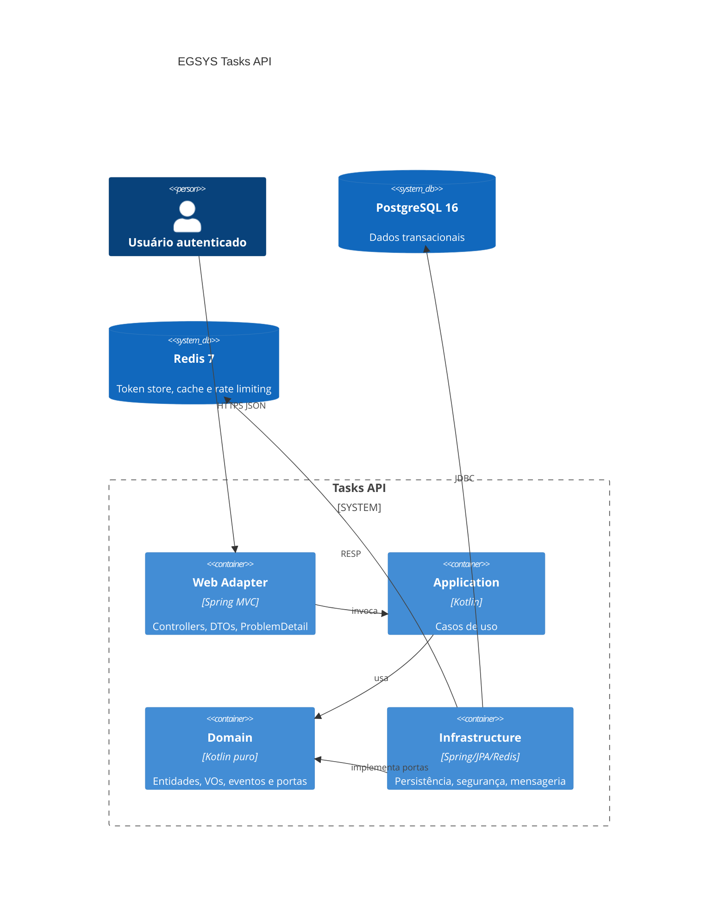

# 🚀 EGSYS Tasks API

[](https://github.com/omatheusdutra/teste-api-spring-egsys/actions/workflows/ci.yml)
[](https://github.com/omatheusdutra/teste-api-spring-egsys/actions/workflows/security.yml)
[](https://github.com/omatheusdutra/teste-api-spring-egsys/tags)


API RESTful de tarefas em Kotlin + Spring Boot, construída para o teste técnico da EGSYS com foco de produção:
segurança por padrão, arquitetura hexagonal, observabilidade, testes automatizados e experiência de avaliação rápida.

## ✅ Entrega

- CRUD completo de tarefas e listagem de categorias.
- Autenticação com JWT RS256, refresh token rotation, revogação por Redis, Argon2id e RBAC.
- Anti-IDOR por ownership no servidor, DTOs explícitos e validações com ProblemDetail.
- Soft delete, status com máquina de estados, histórico auditável, Outbox Pattern e exportação CSV.
- Logs JSON com correlation ID, métricas Prometheus protegidas, tracing OTLP e health checks customizados.
- Docker Compose com API, PostgreSQL, Redis, Prometheus e Grafana.
- Playground interativo em `/playground`, com modo demo controlado em produção.
- Scripts de pentest defensivo reproduzíveis em `tools/pentest/`.

## 🧱 Stack

- Kotlin 2.x, JVM 21, Spring Boot 3.5.x, Gradle Kotlin DSL.
- PostgreSQL 16, Redis 7, Spring Data JPA, Hibernate e Flyway.
- Spring Security 6, JJWT, Bouncy Castle, Jakarta Bean Validation.
- JUnit 5, Kotest assertions, MockK, Testcontainers, ArchUnit, JaCoCo e Pitest.
- Micrometer, Prometheus, OpenTelemetry, Logback JSON.
- Dockerfile multi-stage/distroless, GitHub Actions, Trivy, Semgrep e gitleaks.

## 🐳 Como Executar

Subir tudo em containers:

```bash
docker compose up -d --build
```

Rodar a API local usando Postgres/Redis do Compose:

```bash
docker compose up -d postgres redis
./gradlew bootRun
```

Habilitar playground com demonstrações ofensivas em ambiente controlado:

```bash
docker compose up -d postgres redis
SPRING_PROFILES_ACTIVE=dev EGSYS_DB_PASSWORD=egsys_local_password ./gradlew bootRun
```

Comandos curtos também estão no `Makefile`: `make check`, `make pitest`, `make compose-up`, `make docker-build`.

## ⚡ Tour de 30s

1. Abra `http://localhost:8080` e clique em **Abrir Playground Interativo**, ou acesse `http://localhost:8080/playground`.
2. Registre um usuário ou faça login pelo painel de autenticação.
3. Crie uma tarefa, liste, altere status, consulte histórico e exporte CSV.
4. Em `dev`/`local`, use **Provoque uma defesa** para ver a API bloqueando cenários de ataque.

Alternativa via cliente HTTP: importe a coleção Bruno em `bruno/egsys-tasks-api` e execute `01 Register`, `02 Login`,
`03 Create Task` e `04 List Tasks`.

## 🧪 Como Testar

```bash
./gradlew check
./gradlew pitest
```

Pentest defensivo local:

```bash
rm -f tools/pentest/.results.tsv
eval "$(bash tools/pentest/setup.sh)"
bash tools/pentest/01-auth-idor.sh
bash tools/pentest/02-input-sqli-xss.sh
bash tools/pentest/03-rate-headers-playground.sh
```

Evidências:

- Relatório de pentest: [docs/pentest/REPORT-2026-05-02.md](docs/pentest/REPORT-2026-05-02.md).
- Manual dos scripts: [tools/pentest/README.md](tools/pentest/README.md).

## 🎮 Playground Interativo

O playground é servido por `PlaygroundController` quando `egsys.playground.enabled=true`. O HTML fica fora de
`resources/static`, então não há bypass pelo static resource handler.

Em produção, ele funciona como demo controlada: autenticação, CRUD e visualização continuam disponíveis, mas o painel
ofensivo fica bloqueado por `egsys.playground.attack-demos-enabled=false`. Em `dev`/`local`, os botões ofensivos ficam
ativos para validação defensiva.

Garantias do frontend:

- token apenas em memória JS;
- sem `localStorage`, `sessionStorage`, `eval` ou handlers inline;
- renderização com `createElement`/`textContent`;
- CSP e headers de segurança preservados.

Decisão arquitetural: [ADR 0009](docs/adr/0009-playground-production-demo-controlled.md).

Screenshots da validação visual:

- [Desktop completo](docs/screenshots/playground/desktop-playground.png)
- [Mobile](docs/screenshots/playground/mobile-playground.png)
- [Painel de defesas com vereditos](docs/screenshots/playground/defense-demos-verdicts.png)

## 📚 API REST v1

Swagger UI: `/swagger-ui.html`

Endpoints principais:

- Auth: `POST /api/v1/auth/register`, `/login`, `/refresh`, `/logout`, `/revoke-all/{userId}`.
- Categorias: `GET /api/v1/categorias`.
- Tarefas: `POST /api/v1/tarefas`, `GET /api/v1/tarefas`, `GET /api/v1/tarefas/{id}`,
  `PUT /api/v1/tarefas/{id}`, `DELETE /api/v1/tarefas/{id}`.
- Status/histórico/exportação: `POST /api/v1/tarefas/{id}/status/{status}`,
  `GET /api/v1/tarefas/{id}/historico`, `GET /api/v1/tarefas/export.csv`.
- Observabilidade: `GET /actuator/health`, `GET /actuator/prometheus`.
- Demo: `GET /playground`, `GET /playground/config`.

Erros HTTP usam RFC 7807 `ProblemDetail`. Listagens usam paginação cursor-based.

## 🛡️ Superfície de Ataque

| Vetor | Defesa | Evidência |
| --- | --- | --- |
| JWT `alg=none` / HS256 | rejeição explícita de algoritmos não RS256 | `AuthenticationTests`, `01-auth-idor.sh` |
| Token expirado, adulterado ou revogado | claims rigorosas + blacklist Redis por JTI | `AuthenticationTests`, `JwtReplayTests` |
| Refresh token reutilizado | rotação e revogação da família | `RefreshTokenReuseTests` |
| IDOR em tarefas | ownership em use cases e queries por `owner_id` | `IdorTests`, `01-auth-idor.sh` |
| Mass assignment | DTOs explícitos e `ignoreUnknown=false` | `MassAssignmentTests` |
| SQL injection | JPA/JPQL parametrizado e cursor opaco | `SqlInjectionTests`, `02-input-sqli-xss.sh` |
| XSS/reflection | JSON correto, `nosniff`, CSP e `textContent` no playground | `XssReflectionTests`, `PlaygroundFrontendTest` |
| Brute force / abuso | rate limiting por IP/usuário com `Retry-After` | `BruteForceTests`, `03-rate-headers-playground.sh` |
| Info leak | ProblemDetail sem stack trace e header `Server` removido | `InfoLeakTests` |
| Métricas internas | `/actuator/prometheus` exige JWT | `AuthorizationAndHeadersTests` |
| Playground ofensivo em prod | demo permitida, ataques bloqueados por propriedade | `PlaygroundAvailabilityTests` |

## 📈 Observabilidade

- Logs JSON com `correlationId` e `userId` no MDC quando presentes.
- `X-Correlation-Id` propagado em toda resposta; valores inválidos são descartados.
- Prometheus protegido por JWT em `/actuator/prometheus`.
- Tracing via OTLP em `OTEL_EXPORTER_OTLP_ENDPOINT`.
- Health checks customizados para PostgreSQL e Redis.

## 🏗️ Arquitetura



## 📝 ADRs

| ADR | Decisão |
| --- | --- |
| [0001](docs/adr/0001-bootstrap-stack.md) | Bootstrap stack |
| [0002](docs/adr/0002-persistencia-postgresql-flyway-jpa.md) | Persistência PostgreSQL, Flyway e JPA |
| [0003](docs/adr/0003-api-rest-problemdetail-cursor.md) | API REST com ProblemDetail e cursor pagination |
| [0004](docs/adr/0004-seguranca-jwt-rs256-rbac.md) | Segurança JWT RS256, RBAC e anti-IDOR |
| [0005](docs/adr/0005-observabilidade-prometheus-otel.md) | Observabilidade com logs JSON, Prometheus e OTLP |
| [0006](docs/adr/0006-inovacoes-outbox-historico-status-csv.md) | Outbox, histórico, status e CSV |
| [0007](docs/adr/0007-devex-deploy-local.md) | DevEx e deploy local |
| [0008](docs/adr/0008-playground-dev-only.md) | Decisão anterior do playground, substituída |
| [0009](docs/adr/0009-playground-production-demo-controlled.md) | Playground como demo controlada por propriedades |

## 🗺️ Roadmap Futuro

| Item | Motivo |
| --- | --- |
| Worker de Outbox | publicar notificações/email/WebSocket com retry e idempotência |
| Importação CSV/iCal | fechar ciclo de interoperabilidade de tarefas |
| Dashboards Grafana versionados | entregar painéis prontos além do datasource |
| Push de imagem GHCR | publicar imagem assinada em tags `v*` |
| OWASP Dependency-Check com NVD API key | tornar SCA menos sujeito a rate limit externo |
